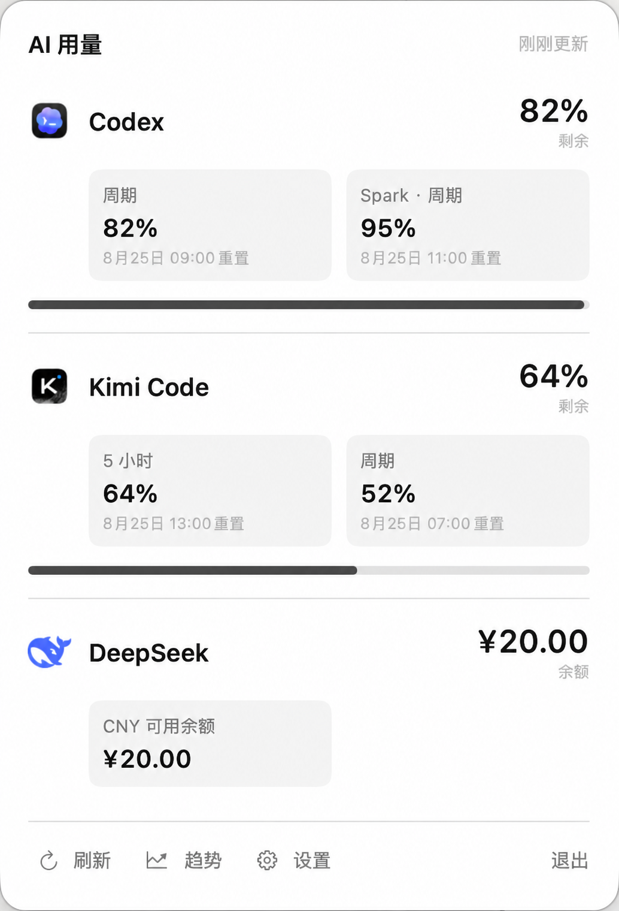
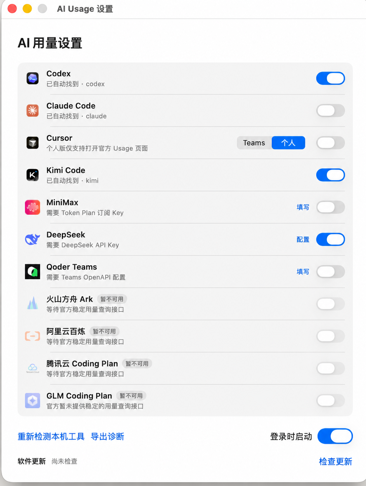
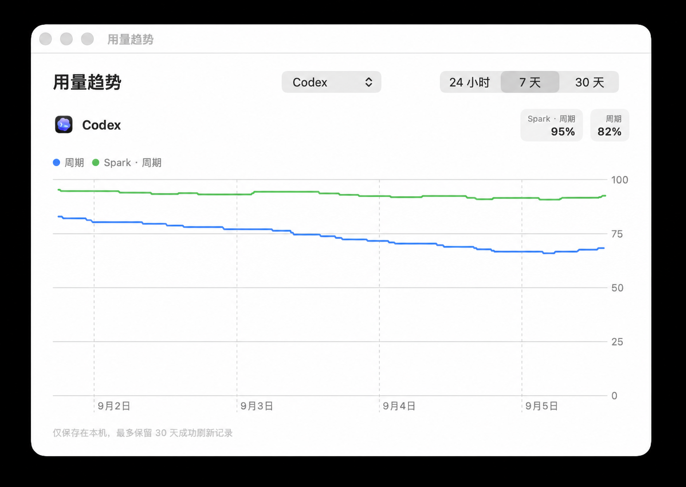

# AI Usage

[English](./README.md) | 简体中文

[](https://github.com/iambean/AI-usage-monitor/actions/workflows/release.yml)

一款轻量、原生的 macOS 菜单栏应用，用于查看 AI 编程服务的剩余额度、用量周期或账户余额。

应用默认只启用 Codex。你可以在设置中启用其他数据源；菜单栏会常驻显示第一个已启用数据源的精简摘要，展开后显示各数据源的详细信息。

> [!NOTE]
> **AI Usage 仅支持 macOS。** 支持 macOS 13 及以上版本，仅兼容 Apple Silicon
>（M 系）Mac；目前没有支持 Intel Mac 和 Windows 的计划。

> [!IMPORTANT]
> AI Usage 是独立、非官方的社区项目，与下列任何厂商均不存在隶属、授权、认可或赞助关系。

## 效果预览

<table>
  <tr>
    <td align="center" width="50%">
      
      <br /><sub>厂商用量总览</sub>
    </td>
    <td align="center" width="50%">
      
      <br /><sub>数据源设置与本机工具自动发现</sub>
    </td>
  </tr>
</table>

<p align="center">
  
  <br /><sub>本地 24 小时、7 天和 30 天用量趋势</sub>
</p>

> 效果图使用合成演示数据，不包含个人账户信息。

## 功能特点

- 基于 SwiftUI 的原生 macOS 菜单栏体验，支持 macOS 13 及以上版本
- 菜单栏常驻显示精简用量，展开后逐行查看详细数据
- 周期型数据源优先在菜单栏显示 5 小时剩余用量，展开后分栏显示各周期及精确重置时间
- 主面板和设置窗口遵循 macOS 自然窗口层级，切换应用后不强制置顶
- 设置内可切换跟随系统、简体中文或 English，默认跟随系统并以简体中文作为回退语言
- 自动发现本机安装的 Codex、Claude Code 和 Kimi Code
- API 型数据源的凭证保存在 macOS 钥匙串
- 默认数据源保持正常刷新，次要数据源每小时后台刷新，展开面板时立即刷新全部
- macOS 开启低电量模式时自动减少后台查询
- 查询失败后清空旧数据，显示明确的不可用状态和解决建议
- 提供 24 小时、7 天和 30 天本地用量变化曲线
- 支持导出本地脱敏诊断包，不接入第三方遥测
- 每天最多在后台检查一次 GitHub Releases 新版本
- 支持登录时启动
- 仅提供 Apple Silicon（arm64）构建
- 不经过项目自建中转服务器，不包含项目自建的分析或遥测后端

## 数据源支持

| 数据源 | 状态 | 配置方式 | 展示内容 |
| --- | --- | --- | --- |
| Codex | 可用，默认启用 | 自动发现本机 Codex CLI | 剩余百分比、各用量周期和重置时间 |
| Claude Code | 可用 | 自动发现 Claude Code，并安装由本应用管理的状态栏采集器 | 可用用量周期和重置时间 |
| Cursor | Teams 可用；个人版仅网页入口 | Teams 管理员 Admin API Key；行内切换 Teams/个人 | Teams 本周期支出和成员数；个人版打开官方 Usage 页面 |
| Kimi Code | 可用，尽力兼容 | 自动发现 Kimi Code，并读取本机登录态 | 套餐用量周期 |
| MiniMax | 可用，尽力兼容 | Token Plan 订阅 Key | 剩余百分比和重置周期 |
| DeepSeek | 可用 | DeepSeek API Key | API 账户余额 |
| Qoder Teams | 可用 | Teams API Key、Organization ID 和 Member ID | 套餐、资源包、团队共享和总额度 |
| 火山方舟 Ark | 暂不可选 | 无 | 保留入口，等待官方稳定用量查询接口 |
| 阿里云百炼 | 暂不可选 | 无 | 保留入口，等待官方稳定用量查询接口 |
| 腾讯云 Coding Plan | 暂不可选 | 无 | 保留入口，等待官方稳定用量查询接口 |
| GLM Coding Plan | 暂不可选 | 无 | 保留入口，等待稳定的用量查询集成 |

厂商接口和本地 CLI 数据格式可能在不通知本项目的情况下变化。“可用”表示本项目已经实现相应集成，不代表能够永久兼容上游变化。

## 资源与可靠性

- 默认数据源保持正常刷新；次要数据源在后台降低刷新频率，展开面板时立即刷新全部数据源。
- macOS 开启低电量模式时自动减少后台查询，但始终保留手动刷新。
- 将应用空闲物理内存 35 MB、包含 Codex App Server 后总占用 50 MB
  作为资源红线；连续三次测量超标后才启动针对性优化。
- Codex 启用期间仅保留一个 App Server 进程，并负责退出清理、防止重复实例及异常退出退避。
- 刷新失败时不把旧缓存伪装成最新结果，而是显示明确的不可用状态和对应解决建议。
- 优先使用官方 API；依赖本机 CLI 登录态的集成会明确标注，未经验证的数据源保持不可用。
- 坚持零遥测；诊断信息仅保存在本机、完成脱敏，并只在用户主动操作时导出。
- 趋势曲线仅记录成功刷新结果，数据只保存在本机，并自动清理 30 天前的记录。
- 通过版本标签自动构建 Apple Silicon 安装包并发布到 GitHub Releases；应用使用轻量版本检查，暂不引入后台自动更新框架。

## 安装

### 下载发布版本

发布产物可用时，请从
[GitHub Releases](https://github.com/iambean/AI-usage-monitor/releases)
下载最新的 DMG 或 ZIP。

当前社区发布包使用 ad-hoc 签名，未经 Apple 公证，首次启动时可能触发 macOS Gatekeeper 提示。取得 Apple Developer 所需凭据后，可以再接入 Developer ID 签名与公证。

### 从源码构建

环境要求：

- macOS 13 或更高版本
- Xcode Command Line Tools 或完整 Xcode
- Swift 5.10 或更高版本

```bash
git clone https://github.com/iambean/AI-usage-monitor.git
cd AI-usage-monitor
swift test
./scripts/build-app.sh
open "dist/AI Usage.app"
```

生成 Apple Silicon（arm64）架构的 DMG 和 ZIP：

```bash
./scripts/package-release.sh
```

打包脚本默认使用 ad-hoc 签名。面向其他用户分发时，请配置 Developer ID 签名和公证信息：

```bash
AI_USAGE_SIGNING_IDENTITY="Developer ID Application: ..." \
  ./scripts/package-release.sh

AI_USAGE_NOTARY_PROFILE="notary-profile" \
  ./scripts/notarize-release.sh "dist/AI-Usage-<version>-arm64.dmg"
```

### 发布新版本

先修改 `Resources/Info.plist` 中的 `CFBundleShortVersionString` 和
`CFBundleVersion`，提交并推送代码，再创建并推送与版本号一致的语义化标签：

```bash
git tag v0.3.1
git push origin v0.3.1
```

Release 工作流会校验标签与应用版本、运行测试、构建并验证 Apple Silicon
DMG/ZIP、生成 SHA-256 校验文件，最后自动发布 GitHub Release。普通分支 push
不会触发发布。

## 配置方式与本地改动

- **Codex：**应用自动定位 `codex` 可执行文件，并与其本地 App Server 进程通信。
- **Claude Code：**启用后可能在 `~/.claude/settings.json` 中添加由 AI Usage 管理的 `statusLine` 命令；如果已有其他 `statusLine` 配置，应用不会覆盖。关闭该数据源时，只移除由 AI Usage 创建的配置。
- **Kimi Code：**应用自动定位 `kimi` 可执行文件，读取 Mac 上保存的 Kimi Code 登录态，并在短期 Access Token 即将到期时自动续期。
- **Cursor：**默认使用 Teams 模式，管理员 API Key 保存在 macOS 钥匙串并以保守频率读取官方团队用量；切换到个人模式后不抓取未公开接口，仅打开官方 Usage 页面。
- **MiniMax：**支持自动检测、海外、中国大陆三种服务区域；Token Plan Key 保存在 macOS 钥匙串。
- **DeepSeek 和 Qoder：**密钥保存在 macOS 钥匙串；非敏感的数据源配置保存在应用的本地偏好设置中。
- **登录时启动：**通过 macOS Service Management 框架管理。

## 隐私与安全

- AI Usage 不运营任何中转服务器。
- 数据源请求由 Mac 直接发送至对应厂商。
- API Key 保存在 macOS 钥匙串中，不会写入本仓库。
- Codex、Claude Code 和 Kimi Code 集成只读取采集用量所需的本地状态。
- 应用不包含自建的分析或遥测服务。

各厂商仍会按照其隐私政策和服务条款处理请求。启用集成前，请自行阅读对应厂商政策。

## 参与贡献

欢迎提交 Issue 和 Pull Request。请注意：

1. 说明涉及的数据源、期望行为和实际行为。
2. 不要在 Issue 中提交 API Key、Access Token、账户标识或原始私密响应。
3. 修改解析器或数据源集成时，请同步新增或更新测试。
4. 提交 Pull Request 前运行 `swift test`。
5. 保持保守的查询频率，并遵循厂商的上游要求。

提交贡献即表示你同意相关内容可以按照本项目的 MIT License 分发。

## 第三方资源与商标

本仓库没有使用第三方 Swift Package 依赖。项目使用 Apple 系统框架和系统提供的 SF Symbols，并仅为识别数据源而包含各厂商的品牌标识。

厂商名称、产品名称、商标及 Logo 均归各自权利人所有，**不属于** MIT License 的授权范围。完整归属说明与许可证边界请参阅
[THIRD_PARTY_NOTICES.md](./THIRD_PARTY_NOTICES.md)。

## 开源协议

源代码与项目原创资源采用 [MIT License](./LICENSE) 开源。

MIT License 不授予任何第三方商标、服务标识、Logo 或其他品牌资源的使用权，具体请参阅
[THIRD_PARTY_NOTICES.md](./THIRD_PARTY_NOTICES.md)。
